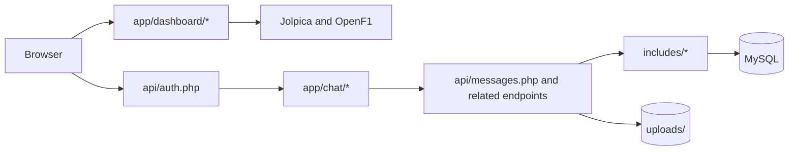

# Covert Messenger Architecture

Covert Messenger is a directly served file tree with a browser application built from plain ES modules. The server sends the application files as written, while PHP answers only the API. The public F1 Dashboard and The Bunker share one document root and one URL. `app/main.js` owns the view boundary and destroys the current view before mounting the other.

---

## Component Map

`index.html` provides metadata, styles and `#root`. Dashboard modules provide Overview, Standings, Race Centre, Head to Head and About. Chat modules divide feed state, the bounded message list, bubbles, composer, outbox, uploads, authenticated media, gallery, preview, search and presence. `app/lib/` owns DOM construction, requests, links, Markdown and time formatting.

---

## Dashboard Data Flow

`app/dashboard/f1data.js` is the shared provider client. It caches response promises in memory and spaces requests to each host by 250 ms. HTTP 429 fails as busy and every other request, status or decoding failure fails as unavailable. A failed promise remains cached until the reader chooses Retry, which bypasses and replaces it; the client performs no automatic retry. Jolpica supplies schedules, standings and race classifications. OpenF1 supplies practice and sprint-qualifying best laps. Views abort stale work when the season or view changes.

The dashboard writes nothing to browser storage. Hidden entry is owned by `app/dashboard/dashboard.js`: a desktop background gesture creates an invisible input, while five rapid logo taps open the mobile keypad.

---

## Authentication and Session Flow

`app/main.js:fingerprint()` hashes the user agent, sorted screen dimensions and colour depth. `api/auth.php` validates that 64-hex fingerprint, checks the published date formats and returns a stateless HMAC token, random session nonce and derived identity. `app/lib/api.js` keeps those values in `sessionStorage` and adds the token and fingerprint to each request.

`includes/auth_check.php:validateToken()` derives identity from the token. Endpoints never accept identity from request data. Page hiding tears down the chat, revokes media, clears session state and returns to the dashboard.

---

## Ordered Change Feed

Every chat mutation runs through `includes/chat.php:withFeedLock()`. It waits up to ten seconds for the database-wide `mirage_feed_<database>` lock and returns HTTP 503 `busy` if the lock is not granted. Once granted, the lock remains held while the transaction applies the mutation, writes one `message_events` row per changed message and commits, then it is released in `finally`.

The first client read requests `?initial=1`, receiving the latest 50 messages and a cursor read before them. Later polls request `?after=<cursor>` and receive at most 200 events. Reading the cursor first permits duplicate delivery but prevents a change committed between the reads from being missed. The client replaces messages by ID, so repeated delivery is safe.

Visible polling runs every four seconds. Failures back off to 60 seconds, a backlog polls immediately, and HTTP 401 expires the chat. Presence is derived from the other identity's latest poll, measured by the database clock; 15 seconds is the present threshold.

---

## Messages and History

`api/messages.php` supports initial and cursor reads, pages before an ID, a 51-message context window around an ID, full-history text search and media-only pages. Sends are idempotent through `message_requests`. Replies retain a foreign key to the parent and return a 200-character quote. Deleted rows remain as tombstones so both clients converge.

`app/chat/messageList.js` renders at most 100 bubbles and moves the window by 30. Every scroll event records whether the reader is at the bottom before a poll or page can repaint the list. Loading older history preserves scroll position, and `app/chat/chatPage.js` repaints after a top-edge request only when older messages arrived. Search, reply and gallery jumps use a separate context view rather than creating a gap in the live list.

---

## Upload and Media Pipeline

Initiation writes an identity-bound manifest. The browser sends exact 1 MiB chunks, and completion verifies every chunk before assembly. A completed file becomes a pending attachment owned by the uploader. Sending a message claims it transactionally; pending files may be discarded only by their uploader.

Media is requested through authenticated `fetch()` and exposed as temporary object URLs because native media elements cannot add the bearer header. Shared leases avoid duplicate downloads. Video thumbnails are limited to 25 MiB; the universal viewer handles supported browser formats and offers downloads for the rest.

---

## Link Previews and Rendering

The server fetches link metadata through `includes/preview.php` under public-address and redirect checks. The browser extracts web addresses outside code spans and builds cards from returned title and description fields. `app/chat/bubble.js` adds an image element only when the preview response includes an HTTPS image.

`app/lib/dom.js` creates nodes and assigns text. Chat Markdown and document previews are built as DOM nodes rather than injected HTML, keeping untrusted message and attachment content out of the HTML parser.

---

## Storage Model

`schema.sql` defines eight InnoDB tables: entry metadata, messages, attachments, attachment owners, reactions, presence, events and idempotency requests. Foreign keys retain reply continuity, cascade attachment and event cleanup with a message, and remove attachment ownership with the attachment.

Files live under `uploads/`; direct web access is denied. Database timestamps and presence calculations use UTC.

---

## Failure Handling

Known API refusals use JSON error codes and explicit HTTP status values. Unexpected exceptions are logged with the `mirage:` prefix and returned as a bare `server_error`, without query or path details. A busy feed lock returns 503. Browser requests expose status through `ApiError`, allowing expiry, retry and rollback behaviour to remain distinct.

---

## Verification

`npm test` runs the Node unit suites. `node tests/php_gate.mjs` exercises the PHP endpoints against disposable MySQL. `node tests/browser_gate.mjs` drives both identities in Chromium, applies the shipped security headers and replaces only the two F1 providers with recorded fixtures.

The gate variables are documented in [CONFIGURATION.md](CONFIGURATION.md).

---

 

**_Architected by Nauman Shahid_**

 

 

Licensed under the [MIT Licence](../LICENSE). Bundled Inter and JetBrains Mono fonts are licensed under the SIL Open Font License 1.1: [Inter licence](../app/fonts/Inter-LICENSE.txt) and [JetBrains Mono licence](../app/fonts/JetBrainsMono-LICENSE.txt).
